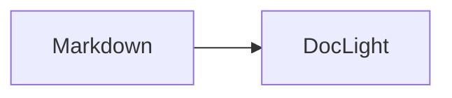

<div align="center">

# DocLight

**把 Markdown 变成作品。** Agent 写，DocLight 渲染成专业的文档与演示——无需构建、开箱即用、随时可定制。

[](LICENSE)


</div>

---

## 这是什么

DocLight 是 Markdown 的**表现层**：内容的质量是 Agent/人的领域，DocLight 负责"长什么样"——
用渲染、排版、图表、动效、主题、演示，把纯 Markdown 的视觉表现力拉到顶级。

- 📄 **文档**：零构建文档站引擎——一个 `docs/` 文件夹 + Markdown = 文档站
- 🎬 **演示**：同一份内容可独立编排成演示（与文档同源不同形，绝不做机械切页）
- 🤖 **AI 原生**：Agent 写内容前读 `/capabilities.json` 知道这个站能渲染什么；
  写完后 llms.txt / MCP 让 Agent 读取最优
- 🚀 **零构建三形态**：dev 实时预览 / SSG 静态导出（SEO 全套）/ 单文件 bundle（file:// 离线分发）

## 快速开始

```bash
npx doclight init my-docs    # 初始化（doclight.json + 示例 docs/ + index.html）
cd my-docs
npx doclight dev             # 本地实时预览 → http://localhost:3000
```

写内容：在 `docs/` 下放 Markdown 文件（文件夹 = 导航分组，根级 `README.md` 收敛为首页），
导航、目录、搜索、暗色模式全部自动。扩展语法开箱即用：

```markdown
:::tip
自定义容器：提示 / 警告 / 危险 / 信息
:::

$$ E = mc^2 $$     <!-- KaTeX 公式 -->


```

发布：

```bash
doclight build                 # SSG 静态导出（SEO + sitemap + OG 卡片 + llms.txt）
doclight publish --preview     # 预览态（构建 + 预览服务，不发布）
doclight publish               # 发布（发布前自动快照，可 rollback 回滚）
doclight bundle                # 单文件便携包（file:// 双击即开）
```

做演示：

```bash
doclight slides talk.md        # markdown `---` 分页 → 自包含单文件演示
```

## 为什么是「把 Markdown 变成作品」

- **Agent 是第一用户**：内容由 Agent 写，DocLight 保证"同样的 md，经 DocLight 呈现后视觉质量显著更高"
- **视觉质量机器化保障**：设计合规门禁（WCAG AA 对比度 / 8pt 网格 / 1.25 字号节奏）+ 像素级视觉回归
- **低门槛定制打穿传统 CMS**：主题 = CSS 变量覆盖、组件可定制、插件 = 一个 JS 文件——
  "把站点改成暖色调" → Agent 改变量 → 预览
- **开源 + AI 原生**：Mintlify（托管 SaaS）与 Docusaurus（无 AI 原生）之间的真空位

## 功能总览

| 能力 | 说明 |
|---|---|
| 零构建三形态 | dev / SSG / bundle 共享同一渲染内核，产物一致（SNAP-001） |
| 扩展语法 | 代码高亮+复制 / 自定义容器 / KaTeX / Mermaid（插件化，REND-003 容错降级） |
| 4 套设计语言 | Minimal / Serif / Modern（默认暗色）/ Warm，亮暗双令牌 + 主题画廊对比 |
| 演示形态 | `doclight slides`：markdown `---` 分页 → 自包含单文件（键盘导航/全屏/演讲者备注） |
| AI 读取端 | llms.txt 智能分级 + llms-full.txt 全文 + MCP Server（搜索/阅读/大纲/能力清单/写入） |
| 能力协议 | `/capabilities.json`：Agent 写内容前知道站点支持什么（CAP-001） |
| 发布产物 Agent 友好 | 每页 markdown 版本 + token 计数 + llms.txt Link 关系（AEO-001） |
| 工作流 | 预览-确认-发布：publish 前自动快照 + rollback 回滚 + TTY 确认门（WORK-001） |
| 插件系统 | 钩子/插槽/主题包 + 官方插件（giscus/plausible/rss/pwa/ai-chat/mermaid）+ ESM/TS 加载 |
| 一键部署 | gh-pages / Cloudflare / Netlify；`--base` 子路径部署 |

## 文档

- 演示指南：[docs/slides.md](docs/slides.md)
- 主题与组件：[docs/themes.md](docs/themes.md) · [docs/component-gallery.md](docs/component-gallery.md)
- 插件开发：[docs/plugin-guide.md](docs/plugin-guide.md)
- Agent 接入：[docs/agent-guide.md](docs/agent-guide.md)
- 迁移指南：MkDocs / GitBook / docsify

## 开源与贡献

MIT 许可证（[LICENSE](LICENSE)）。DocLight 是"为 Agent 设计、由 Agent 维护"的开源项目：
开发者文档面向 Agent 与人类双读（AGENTS.md 是内容写作入口，AGENT.md 是开发指南）。
欢迎 [提 issue / PR](https://github.com/picsky/doclight)，贡献前请读 [CONTRIBUTING.md](CONTRIBUTING.md)。

## 架构速览

```
docs/*.md ──→ doclight-renderer（渲染内核：marked + DOMPurify + 扩展注册表）
                 │  三形态复用（dev / SSG / bundle）
                 ├─→ 展示层（<25KB gzip，浏览器端交互）
                 ├─→ llms.txt / docs.json / capabilities.json（AI 读取端）
                 └─→ MCP Server（读：search/read/outline；写：write/update/delete）
```

Monorepo（pnpm workspace）：`@doclight/renderer` · `@doclight/core` · `@doclight/display` ·
`@doclight/mcp-server` · `doclight`（CLI 主包）。

## 体积与性能

| 指标 | 门禁 | 实测 |
|---|---|---|
| 展示层 | < 25KB gzip | 10.4KB |
| Node 渲染内核 | < 30KB | 27.8KB（含 marked + DOMPurify） |
| 演示单文件 | ≤ 100KB | ~9KB（4 页示例含壳层） |

## 安全与信任

- **渲染管线全走 DOMPurify 白名单**：dev / SSG / bundle 三形态共用同一套 sanitize，HTML 永远不直接进 DOM。
- **MCP 写入端鉴权**：`doclight dev --mcp` 启动即自动生成 Bearer token（打印到终端并写入 `.doclight/mcp-token`）；写工具（`write_doc` / `update_doc` / `delete_doc`）强制携带，跨站网页无法通过 CORS 劫持写入（Origin 白名单也做了本地回环限制）。
- **路径穿越防护**：所有文件写入/读取路径都强制校验——相对路径、无 `..`、解析后必须落在对应根目录内。
- **`llms-full.txt` 是全站 Markdown 明文导出**：`doclight build` 默认把 docs/ 下所有文档全文打包进产物。草稿、私有内容、未脱敏笔记会被同步发布；请用 `build.llmsTxt.exclude` 排除，或把敏感内容移出 docs/ 目录。
- **插件信任模型**：构建时插件（`doclight.json` 中的 `plugins`）等同于站点作者代码——ESM/TS 文件按 `import()` 执行，具有构建进程全部权限。请勿引入不可信来源的插件；展示层插件运行时（`init`/`onMount`）同理，运行在用户浏览器。
- **无 eval / new Function / document.write**：整个代码库禁用这些危险 API，渲染内核用 marked + DOMPurify，发布用 `spawnSync` 数组参数（无 shell 拼接）。

## 状态

Phase 6（v1.0 收尾）全部主线完成：能力协议（P0）→ 表现层设计系统化 / 预览-确认-发布 /
MCP 写入端（P1）→ 演示形态（P2）。剩余仅外部决策项（npm 包名注册与域名）。
