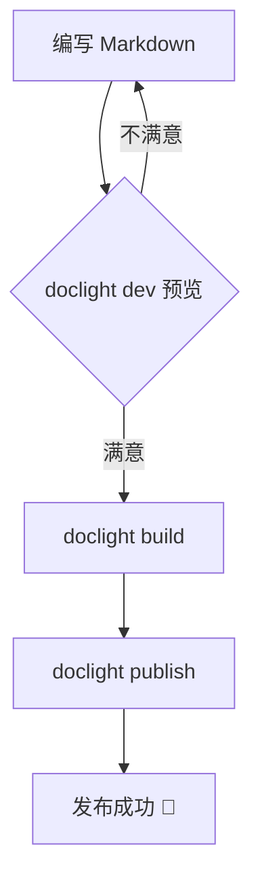
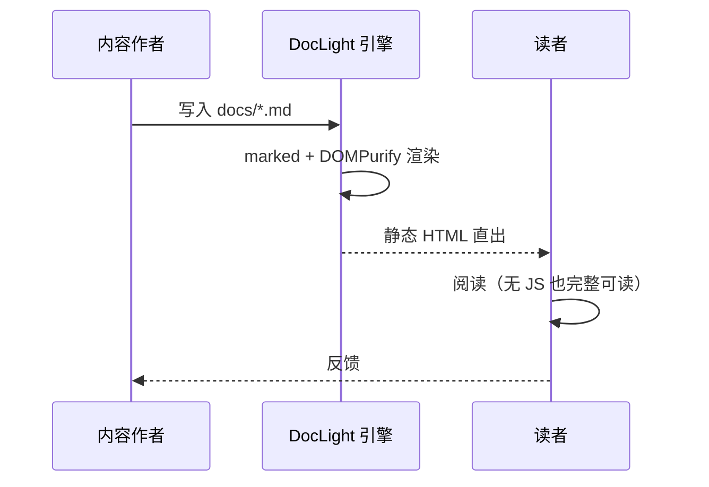
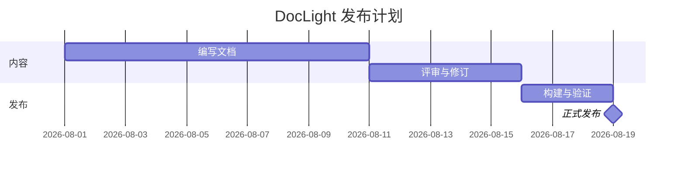
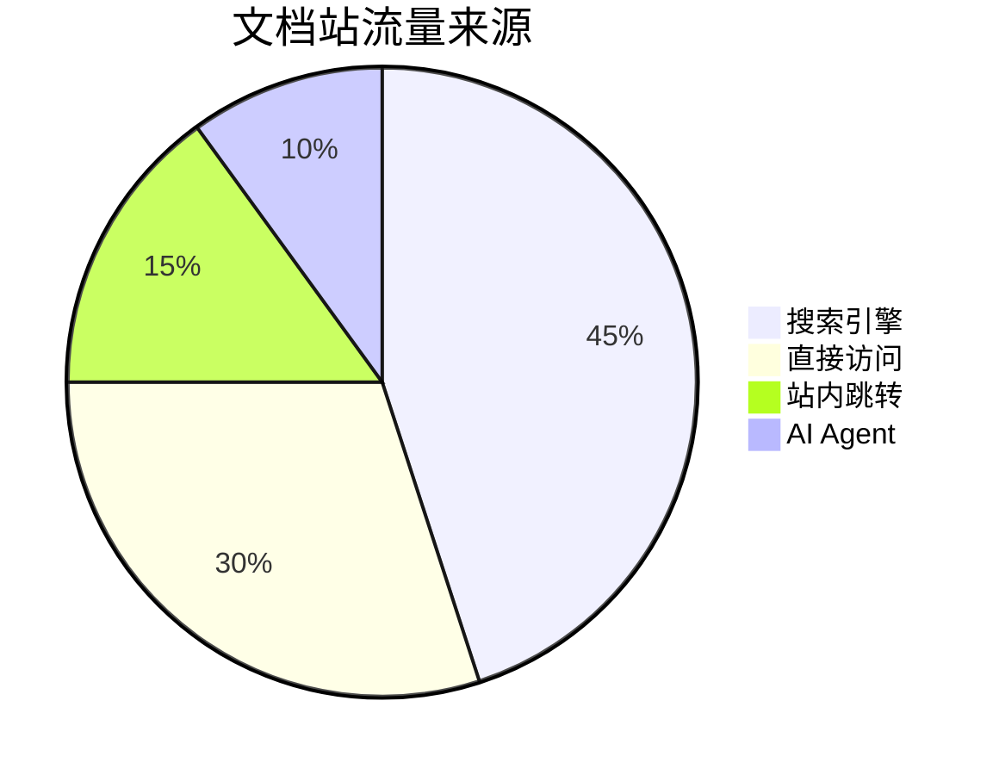
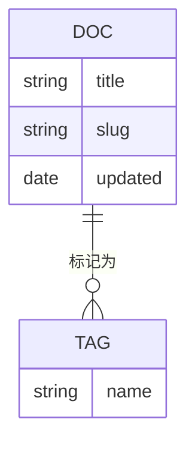

# Mermaid 图表

> 图表由 **Mermaid 官方插件**渲染（本站在 `doclight.json` 中启用了 `plugins: ["mermaid"]`）。
> 图表**懒加载**（mermaid.min.js ≈ 2.4MB 按需拉取），渲染失败时**自动降级为源码**并提示，绝不白屏。
> 暗色模式下图表跟随主题自动切换配色。

## 流程图（Flowchart）



## 时序图（Sequence Diagram）



## 甘特图（Gantt）



## 饼图（Pie）



## ER 图（Entity Relationship）



## 渲染失败时的降级

如果图表语法有误，会**保留源码 + 错误提示**（不会白屏）：

```mermaid
flowchart TD
  这里缺少闭合括号 [
```

:::info
插件启用后，本页五类图表都会渲染为 SVG。若你看到的是代码块而不是图表，说明 vendor 未加载——三形态接线见下文。
:::

## 三形态接线

| 形态 | mermaid.min.js 来源 | 说明 |
| --- | --- | --- |
| `doclight dev` | node_modules 按需服务 | 启用插件即自动可用 |
| `doclight build` | 拷贝进产物 `vendor/` | 自包含，离线可用 |
| `doclight bundle` | 默认不内联（需 `--inline-vendor`） | file:// 下需显式内联 |
