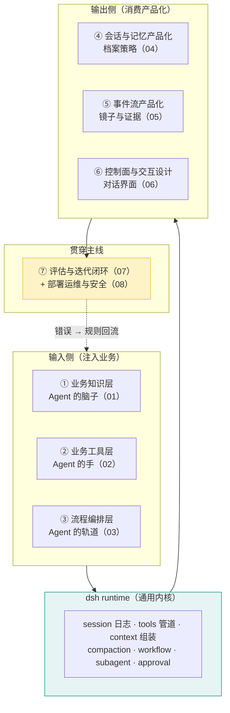

# 00 · 产品工程全景：七块知识如何构成 Agent 产品

> **读者**：任何人。这是整个知识体系的入口——先看全局，再进分篇。
> **本文回答**：Agent 产品 = 什么？七块工作如何协作？两条贯穿主线是什么？

---

## 1. Agent 产品 = 七块工作（+ 一条贯穿主线）

有了 dsh harness 之后，做 Agent 产品的剩余工作收敛为七块——它们不是七个独立模块，是**围绕一个运行中的 Agent 的七个视角**：



**两条贯穿主线**：
1. **评估迭代闭环**（07）：错误 → 规则 → 验证——它连接所有七块，是产品的进化引擎
2. **部署运维**（08）：让一切可靠地跑——它包裹所有七块，是产品的生存基础

## 2. 每个产品的三问定位（进入细节前先回答）

| 问题 | 决定 | 对应篇 |
|---|---|---|
| **你的 Agent 做什么任务？**（一个具体用例） | 知识层与工具层的边界 | 01/02 |
| **任务怎么流？**（对话/分步/工作流） | 编排深度与语言投入 | 03 |
| **过程怎么展示与留存？** | 事件消费的架构 | 05 |

三问回答完，产品形态已经定了 80%——其余是执行。

## 3. 深度决策总纲（贯穿所有分篇）

### 3.1 编排语言路线（03 篇详述）

| 路线 | TS 投入 | 适用 |
|---|---|---|
| Python 编排循环 | 零 | 固定/半固定流程（多数产品） |
| workflow 引擎（模型/代码驱动） | 零～少量 | 动态并行编排 |
| Node 控制面（L3） | 几百行 | 交互密集、引擎级管控 |

### 3.2 定制深度决策（sdk-docs/00 篇对照）

| 深度 | 你能得到 | 代价 |
|---|---|---|
| L1 配置（工具/skills/prompt） | 现成 harness + 业务注入 | 流程由模型决定 |
| L2 模型驱动编排 | + 流程脚本 | 流程质量依赖模型 |
| L3 代码驱动编排 | + 流程完全可控 | Node 服务维护 |
| L4 主循环定制 | + turn 语义可控 | 源码级维护 |

**判断**：流程是你产品的核心资产 → 往 L3 走；流程只是功能 → L1+L2 够。

### 3.3 产品差异化来源（07 篇详述）

有了同一套 dsh，产品差距只剩三处：**知识质量（01）、流程设计（03）、迭代速度（07）**——前两个是起点优势，最后一个是持续优势。

## 4. 知识地图：与全部材料的关系

```
┌────────────────────────────────────────────────────────────┐
│  课程（体系甲/乙）—— 为什么：原理与心智模型                    │
│    六层架构 · 成熟度模型 · 评估方法论                          │
├────────────────────────────────────────────────────────────┤
│  deepseek-harness-解析.md —— 它是什么：产品解剖              │
│    session 日志 · 工具管道 · 约束安全 · Agent Coding 纪律     │
├────────────────────────────────────────────────────────────┤
│  sdk-docs/ —— 怎么调用：接口与机制（10 篇）                   │
│    决策 → 架构 → 上手 → 接口参考 → 协议 → 定制 → 实战 → 边界   │
├────────────────────────────────────────────────────────────┤
│  product-knowledge/ —— 怎么用它做产品（本体系，10 篇）        │
│    00 全景 → 01 知识 → 02 工具 → 03 流程 → 04 会话           │
│    → 05 事件 → 06 控制 → 07 评估 → 08 运维 → 09 路线          │
└────────────────────────────────────────────────────────────┘
```

**阅读路径**：
- 新手：00 → 09（先知道终点）→ 按 01–08 顺序精读
- 动手派：00 → 09 → 直接进路线图的当前阶段 → 按需读分篇
- 深水区：00 → 03（编排决策）→ 07（迭代闭环）→ sdk-docs 补接口

---

**进入分篇**：[01 · 业务知识层](01-业务知识层.md) → 或直接看 [09 · 从零到一产品路线图](09-从零到一产品路线图.md)
